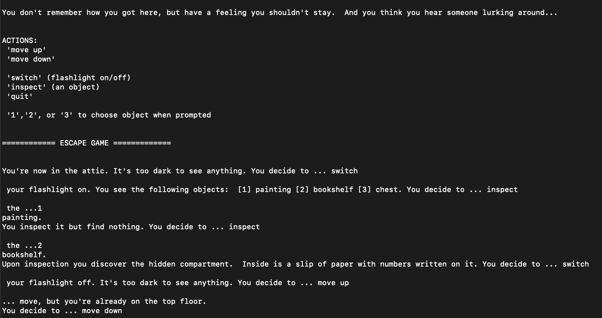
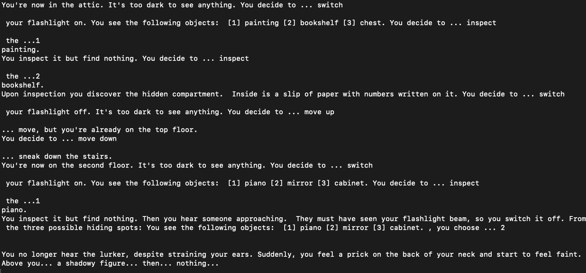

#Escape Game (2020)
Escape a creepy house while being hunted by an enemy.  Four lock combations are needed to unlock the front door and escape.  Combinations are hidden around the house.  As you traverse each floor, search possible hiding spots to find them.  But be careful, and use your flashlight sparingly, as this will allow the hunter to detect you.  If they do, you will have on last chance to hide; but if you fail, the house will become your permanent home.  A text-based, horror-themed roguelike written in Python.

&nbsp;
 

|
